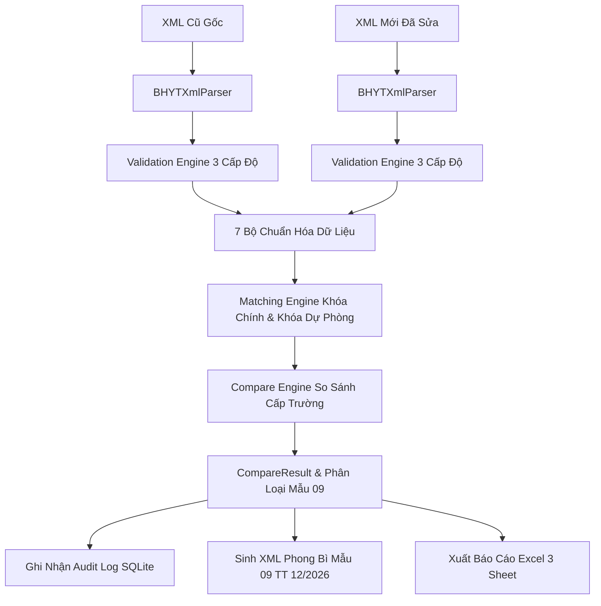

# BHYT XML Adjustment & Reconciliation Tool

Phần mềm chuyên dụng đối soát hồ sơ khám chữa bệnh (KCB) Bảo hiểm Y tế (BHYT), tự động phát hiện sai lệch giữa 2 tệp XML và tạo lập dữ liệu điều chỉnh **Mẫu 09/BH** tuân thủ nghiêm ngặt theo **Quyết định 3176/QĐ-BYT**, **Quyết định 4750/QĐ-BYT** và **Thông tư 12/2026/TT-BTC**.

---

## 🌟 Tính Năng Nổi Bật

### 1. Thuật Toán Đối Soát & Khớp Nối 2 Pha (2-Phase Matching Engine)
- **Khóa chính (Primary Key):** Khớp nối chính xác tuyệt đối theo `MA_LK + STT`.
- **Khóa dự phòng (Fallback Key):** Tự động khôi phục liên kết bản ghi khi số thứ tự `STT` bị trượt, chèn thêm hoặc xóa bớt:
  - **XML2 (Thuốc):** `MA_LK + MA_THUOC + NGAY_YL`
  - **XML3 (DVKT & VTYT):** `MA_LK + MA_DICH_VU + NGAY_YL`
  - **XML4 (CLS):** `MA_LK + MA_DICH_VU + NGAY_KQ`
  - **XML5 (Diễn biến LS):** `MA_LK + NGAY_YL`

### 2. Bộ 7 Chuẩn Hóa Dữ Liệu Tự Động (7 Smart Normalizers)
- **DecimalNormalizer:** Xử lý số thập phân dấu phẩy (`2,20` $\rightarrow$ `2.20`), chuẩn hóa số 0 vô nghĩa sau dấu phẩy.
- **DateNormalizer:** Tự động loại bỏ các mốc thời gian giả lập (`000101010000`, `190001010000` $\rightarrow$ `null`).
- **WhitespaceNormalizer:** Cắt khoảng trắng đầu/cuối và gộp khoảng trắng thừa giữa các ký tự.
- **NullNormalizer:** Đồng nhất `null`, chuỗi rỗng `""` và `"NULL"`.
- **CdataNormalizer:** Bóc tách dữ liệu sạch bên trong các thẻ `<![CDATA[...]]>`.
- **CaseNormalizer:** Chuẩn hóa các trường mã danh mục kỹ thuật về chữ in hoa.
- **CompositeNormalizer:** Chuỗi xử lý nối tiếp không làm gián đoạn luồng dữ liệu.

### 3. Tương Thích Mọi Định Dạng Hồ Sơ BHYT
- **Plain XML & Base64:** Tự động giải mã `<NOIDUNGFILE>` dạng Base64 hoặc đọc trực tiếp XML dạng DOM inline.
- **Multi-Hồ Sơ:** Hỗ trợ xử lý tệp phong bì lớn chứa danh sách nhiều hồ sơ `<HOSO>` trong thẻ `<DANHSACHHOSO>`.
- **Bao phủ 15 bảng XML:** Hỗ trợ đầy đủ `XML1` đến `XML15` theo chuẩn QĐ 4750.

### 4. Tự Động Sinh Mẫu 09/BH & Báo Cáo Đối Soát
- **Sinh XML Mẫu 09:** Tạo cấu trúc phong bì `<GIAMDINHHS>` chuẩn với `<LOAIHOSO>MAU_09</LOAIHOSO>` theo **Thông tư 12/2026/TT-BTC**.
- **Xuất Báo Cáo Excel 3 Sheet:** Sử dụng `excel: ^4.0.6` tạo file báo cáo hoàn chỉnh gồm:
  1. `TongQuan`: Bảng tổng hợp số liệu và chỉ số đối soát.
  2. `ChiTietThayDoi`: Danh sách toàn bộ các trường bị thay đổi giá trị.
  3. `Mau09_DieuChinh`: Bảng kê 16 cột chuẩn Mẫu 09 phục vụ nộp cơ quan BHXH.
- **Bulk Reason Toolbar:** Công cụ chọn và áp dụng lý do điều chỉnh hàng loạt cho toàn bộ danh sách chỉ bằng 1 thao tác.

### 5. Ký Số Điện Tử Đạt Chuẩn Cổng BHXH (XMLDSig RSA-SHA256)
- **Chuẩn pháp lý:** Tuân thủ **Nghị định 130/2018/NĐ-CP** và **Thông tư 18/2022/TT-BTTTT** về quy định chữ ký số cho văn bản điện tử ngành y tế & bảo hiểm.
- **Cấu trúc XMLDSig W3C:** Tự động tính toán Canonicalization (`C14N`), băm dữ liệu `SHA-256` (`DigestValue`), ký số khóa bảo mật `RSA 2048-bit` (`SignatureValue`) và nhúng khối `<Signature>` vào thẻ `<CHUKYSO>`.
- **Tương thích toàn diện:** Hỗ trợ mọi nhà cung cấp chứng thực chữ ký số công cộng (VNPT-CA, Viettel-CA, BKAV-CA, FPT-CA, MISA-CA, Ban Cơ yếu Chính phủ).
- **Kiểm tra tính toàn vẹn (Integrity Check):** Tự động cảnh báo tức thì nếu nội dung XML bị can thiệp/chỉnh sửa sau khi ký.

### 6. Giao Diện Desktop Chuyên Nghiệp (Medical UI & TrinaGrid)
- **Kiến trúc Desktop Master Shell:** Thanh điều hướng Sidebar cố định 250px, chuyển đổi mượt qua `ShellRoute`.
- **Hệ thống Giao diện Sáng/Tối (Light & Dark Mode):** Chuyển đổi mượt mà với bảng màu Medical Teal (`#0D9488`) và Slate 900 (`#0F172A`).
- **Bảng dữ liệu TrinaGrid (`trina_grid: ^2.3.0`):** Hỗ trợ cố định cột (frozen columns), sắp xếp, lọc dữ liệu trực tiếp trên từng cột và điều hướng bằng bàn phím.
- **Side-by-Side Diff Viewer:** Trực quan hóa giá trị cũ (đỏ) và giá trị mới (xanh) kết hợp tìm kiếm TypeAhead.

### 7. Quản Lý Nhật Ký Kiểm Toán (Audit Trail SQLite)
- Lưu vết lịch sử toàn bộ các phiên đối soát vào cơ sở dữ liệu SQLite cục bộ qua `Drift`.
- Tự động ghi nhận mã băm SHA-256 của tệp đầu vào, thời điểm thực hiện và số lượng bản ghi điều chỉnh.
- Tích hợp màn hình chẩn đoán **Talker Monitor** theo dõi toàn bộ runtime logs và BLoC transitions.

---

## 🏛️ Kiến Trúc Hệ Thống (Clean Architecture)

```
┌─────────────────────────────────────────────────────────────┐
│                     PRESENTATION LAYER                      │
│   Pages (Import, Overview, Detail, Export, Audit, Settings) │
│   Widgets (Mau09TrinaGrid, FileDropZone, BHYTAppBar, ...)   │
│   BLoC State Management (flutter_bloc, talker_bloc_logger)  │
└──────────────────────────────┬──────────────────────────────┘
                               │
┌──────────────────────────────▼──────────────────────────────┐
│                      APPLICATION LAYER                      │
│   Use Cases: ImportXml, CompareXml, GenerateMau09, Export   │
└──────────────────────────────┬──────────────────────────────┘
                               │
┌──────────────────────────────▼──────────────────────────────┐
│                        DOMAIN LAYER                         │
│   Entities: XmlEnvelope, HoSo, CompareResult, Mau09Document │
│   Value Objects: ChangeType, RecordKey, FieldChange         │
│   Repository Interfaces: AuditRepository, XmlRepository     │
└──────────────────────────────┬──────────────────────────────┘
                               │
┌──────────────────────────────▼──────────────────────────────┐
│                    INFRASTRUCTURE LAYER                     │
│   Normalizers (7 Engine Rules) • MatchingEngine (2-Phase)   │
│   CompareEngine • Mau09XmlGenerator • Mau09ExcelGenerator   │
│   BHYTXmlParser • Drift SQLite Database (AppDatabase)       │
└─────────────────────────────────────────────────────────────┘
```

---

## 🔄 Luồng Dữ Liệu Xử Lý



---

## 📂 Cấu Trúc Thư Mục Dự Án

```text
lib/
├── app.dart                                # Root Application Widget & MultiBlocProvider
├── main.dart                               # Entrypoint, Khởi tạo DI GetIt & Talker
├── config/
│   ├── standards/                          # Danh mục chuẩn BHYT (QĐ 3176, QĐ 4750, TT 12)
│   │   ├── field_definitions.dart          # 221 trường danh mục chi tiết
│   │   ├── key_definitions.dart            # Định nghĩa khóa chính & khóa dự phòng
│   │   ├── mau09_mappings.dart             # Ma trận điều kiện hợp lệ Mẫu 09
│   │   ├── standard_version.dart           # Enum phiên bản chuẩn
│   │   └── xml_definitions.dart            # Định nghĩa 15 loại bảng XML1..XML15
│   └── theme/                              # Hệ thống Design Tokens & Theme Sáng/Tối
│       ├── app_colors.dart                 # Bảng mã màu Medical Palette
│       └── app_theme.dart                  # Cấu hình ThemeData & ThemeMode notifier
├── core/
│   ├── di/injection.dart                   # Service Locator GetIt
│   ├── errors/failures.dart                # Lớp xử lý lỗi Domain Failures
│   └── logging/app_talker.dart             # Cấu hình Talker logger
├── domain/                                 # Thực thể nghiệp vụ thuần Dart
│   ├── entities/                           # XmlEnvelope, HoSo, CompareResult, Mau09Document...
│   ├── repositories/                       # Interface Repositories
│   └── value_objects/                      # ChangeType, RecordKey, FieldChange...
├── infrastructure/                         # Hiện thực chi tiết kỹ thuật
│   ├── compare/                            # CompareEngine & FieldComparator
│   ├── database/                           # Drift SQLite Tables & AppDatabase
│   ├── matching/                           # MatchingEngine thuật toán 2 pha
│   ├── mau09/                              # Mau09Mapper, Mau09XmlGenerator, Mau09ExcelGenerator
│   ├── normalizers/                        # 7 Bộ chuẩn hóa dữ liệu
│   ├── repositories/                       # DriftAuditRepository, ExportRepositoryImpl
│   ├── validation/                         # ValidationEngine 3 cấp độ
│   └── xml/                                # BHYTXmlParser (Plain XML, Base64, Multi-HOSO)
├── application/                            # Các Use Cases điều phối
└── presentation/                           # Giao diện người dùng & Quản lý trạng thái
    ├── blocs/                              # ImportBloc, CompareBloc, Mau09Bloc, AuditBloc
    ├── pages/                              # ImportPage, OverviewPage, DetailPage, ExportPage, AuditLogPage, SettingsPage
    └── widgets/                            # Mau09TrinaGrid, OverviewBreakdownTrinaGrid, AuditLogTrinaGrid, BHYTAppBar...
```

---

## 🚀 Hướng Dẫn Cài Đặt & Chạy Ứng Dụng

### Yêu cầu môi trường
- **Flutter SDK:** $\ge$ `3.27.0`
- **Dart SDK:** $\ge$ `3.13.1`

### 1. Cài đặt các gói phụ thuộc
```bash
flutter pub get
```

### 2. Sinh mã tự động (Drift SQLite & Freezed)
```bash
dart run build_runner build --delete-conflicting-outputs
```

### 3. Chạy toàn bộ bộ kiểm thử tự động
```bash
flutter test
```

### 4. Kiểm tra phân tích tĩnh
```bash
dart analyze
```

### 5. Chạy ứng dụng trên máy tính
```bash
flutter run -d windows
# Hoặc trên macOS/Linux:
# flutter run -d macos
# flutter run -d linux
```

---

## 📋 Tiêu Chuẩn & Căn Cứ Pháp Lý
1. **Quyết định 3176/QĐ-BYT:** Quy định về danh mục, định dạng dữ liệu đầu ra phục vụ giám định KCB BHYT.
2. **Quyết định 4750/QĐ-BYT:** Chuẩn dữ liệu đầu ra và định dạng các bảng XML1 đến XML15.
3. **Thông tư 12/2026/TT-BTC:** Quy định chi tiết cấu trúc, nội dung và nguyên tắc lập Mẫu 09/BH điều chỉnh thanh toán chi phí KCB BHYT.

---

## 📄 Bản Quyền & Giấy Phép
Dự án phát triển phục vụ công tác đối soát dữ liệu y tế và giám định KCB BHYT.
Phát hành theo giấy phép nội bộ.
